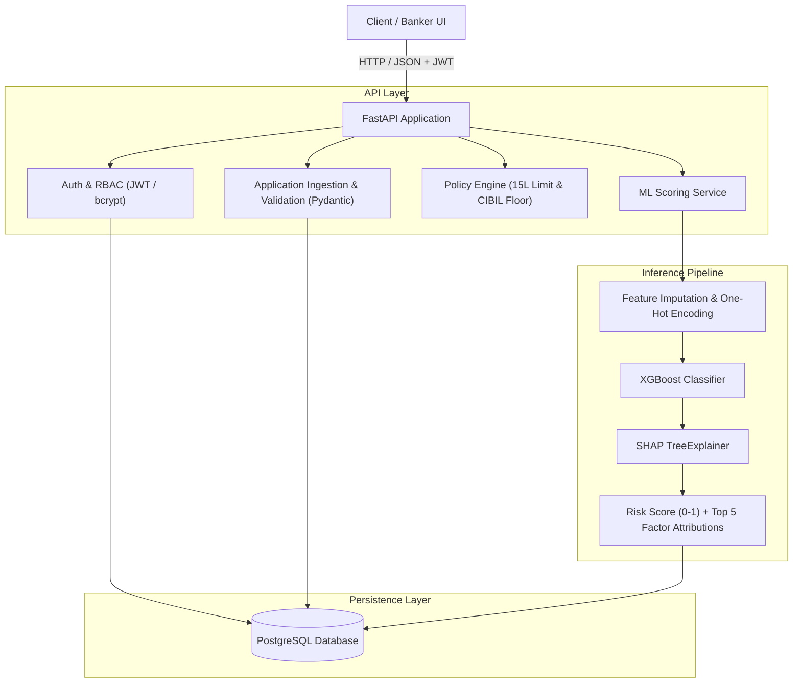

# Loan Default Early Warning System (EWS)

The Loan Default Early Warning System (EWS) is an end-to-end credit risk evaluation platform designed to predict loan applicant default probabilities in real time. Traditional credit scoring often relies on static heuristic scorecards that struggle with non-linear feature interactions and lack transparency. This platform addresses that by coupling a gradient-boosted decision tree pipeline with local SHAP feature attributions and policy-driven guardrails, served via an asynchronous REST API. Credit officers can evaluate risk tiers, audit decisions, and inspect individual default drivers instantly.

---

## Architecture Overview



### Component Breakdown
- **FastAPI Backend**: Provides high-throughput, asynchronous REST endpoints for applicant registration, role-based authentication (Banker vs. Applicant via JWT), loan application submission, and scoring.
- **PostgreSQL Database**: Serves as the transactional system of record maintaining customer demographic profiles, active applications, prior loan disbursement histories, and audit records with relational foreign-key integrity.
- **XGBoost Inference Engine**: Evaluates applicant tabular profiles against a gradient-boosted decision tree model trained to estimate default likelihood under class imbalance.
- **SHAP (SHapley Additive exPlanations)**: Computes exact local feature attributions using `TreeExplainer` for every scored applicant, providing credit officers with the top positive and negative drivers behind each risk prediction.
- **Policy Guardrail Engine**: Enforces deterministic credit limits (e.g., maximum portfolio exposure cap across active loans) and heuristic overrides (e.g., minimum credit bureau score floor) ahead of machine learning inference.
- **Container Network**: Orchestrated via Docker Compose with dedicated backend, database, and isolated bridge networking.

---

## Machine Learning Methodology

### Input Features & Transformations
The model processes tabular demographic, financial, and external bureau features:

| Feature Name | Type | Description | Handling |
| :--- | :--- | :--- | :--- |
| `AMT_INCOME_TOTAL` | Numeric | Total annual applicant income | Median imputation |
| `AMT_CREDIT` | Numeric | Requested principal credit amount | Median imputation |
| `AMT_ANNUITY` | Numeric | Scheduled loan annuity obligation | Median imputation |
| `DAYS_BIRTH` | Numeric | Applicant age in negative days relative to application | Normalized / Median imputation |
| `DAYS_EMPLOYED` | Numeric | Employment duration in negative days | Median imputation |
| `NAME_EDUCATION_TYPE` | Categorical | Applicant educational attainment | One-hot encoded (`pd.get_dummies`) |
| `EXT_SOURCE_2` | Numeric | Normalized external credit score from Bureau 2 | Median imputation |
| `EXT_SOURCE_3` | Numeric | Normalized external credit score from Bureau 3 | Median imputation |
| `REGION_POPULATION_RELATIVE`| Numeric | Population density index of applicant's locality | Median imputation |
| `DAYS_ID_PUBLISH` | Numeric | Days since last identity document update | Median imputation |

### Class Imbalance Handling
Financial default datasets exhibit significant class imbalance, with non-defaulting loans heavily outnumbering defaults. The training pipeline compensates by setting the objective weight:

$$\text{scale\_pos\_weight} = \frac{N_{\text{negative}}}{N_{\text{positive}}}$$

This penalizes misclassifications on the minority (defaulted) class proportionally during gradient boosting steps, preventing majority-class collapse.

### Validation Scheme
The dataset is split into an 80/20 train/test partition using stratified sampling:
```python
train_test_split(X, y, test_size=0.2, random_state=42, stratify=y)
```
Stratification guarantees that both training and holdout test sets maintain the exact same default ratio.

### Evaluation Metrics
The training pipeline evaluates:
- **ROC-AUC**: Primary discriminative metric for default ranking across decision thresholds.
- **Accuracy & Confusion Matrix**: Stored in `models/evaluation_report.json` to monitor false-positive (unwarranted rejection) and false-negative (bad debt) trade-offs.

### Dataset Acquisition
The training pipeline requires the Home Credit Default Risk benchmark dataset:
1. Download `application_train.csv` from [Kaggle's Home Credit Default Risk competition](https://www.kaggle.com/c/home-credit-default-risk/data).
2. Save the file to `data/loan_data.csv` ensuring it includes the target column `TARGET` along with the input features listed above.
3. Execute `python train_model.py` to train and serialize the model artifacts into `models/`.

---

## Core API Endpoints

| Method | Endpoint | Access | Description |
| :--- | :--- | :--- | :--- |
| `POST` | `/auth/register` | Public | Register a new user (`applicant` or `banker` role) |
| `POST` | `/auth/login` | Public | Authenticate credentials and receive a JWT Bearer token |
| `POST` | `/customers/` | Authenticated | Submit a new loan application |
| `GET` | `/customers/` | Banker | List all customer applications and review statuses |
| `GET` | `/customers/{id}` | Authenticated | Retrieve customer details and credit history |
| `POST` | `/customers/score/{id}` | Banker | Run policy checks, ML inference, and SHAP explainability |

---

## Quickstart

### Option 1: Running with Docker Compose (Recommended)

#### Prerequisites
- Docker Engine 20.10+
- Docker Compose v2+

#### Start Services
```bash
# Clone the repository
git clone https://github.com/Anshika-17a/Loan.git
cd Loan

# Start backend and database services in detached mode
docker-compose up -d backend db

# Verify container status
docker-compose ps
```

#### Service URLs
- **Backend API Docs (Swagger UI)**: `http://localhost:8000/docs`
- **Interactive OpenAPI Spec**: `http://localhost:8000/redoc`
- **PostgreSQL Database**: `localhost:5432` (database: `loan_risk_db`, user: `postgres`)

#### Stop Services
```bash
docker-compose down
```

---

### Option 2: Running Locally (Native Python)

#### Prerequisites
- Python 3.10+
- Running PostgreSQL instance (or local SQLite)

#### Setup & Execution
```bash
# Create and activate virtual environment
python -m venv .venv
source .venv/bin/activate  # On Windows: .venv\Scripts\Activate.ps1

# Install dependencies
pip install -r requirements.txt

# Configure environment variables
cp .env.example .env

# Run the FastAPI server
uvicorn app.main:app --host 127.0.0.1 --port 8000 --reload
```

---

## Testing & Verification

A suite of verification scripts is provided in the `scripts/` directory to test the platform end-to-end:

```bash
# 1. Verify user registration
python scripts/verify_registration.py

# 2. Verify authentication and JWT issuance
python scripts/verify_login.py

# 3. Verify customer application intake and banker listing
python scripts/verify_list_customers.py

# 4. Verify policy guardrails (exposure limit & credit floor)
python scripts/verify_risk_logic.py

# 5. Run complete application lifecycle
python scripts/verify_full_flow.py
```

---

## Project Structure

```text
.
├── app/
│   ├── routers/
│   │   ├── auth.py              # User authentication and registration routes
│   │   ├── customers.py         # Application intake, underwriting, and scoring routes
│   │   └── plaid.py             # Financial data integration routes
│   ├── services/
│   │   ├── ml_service.py        # Model loading, ensemble inference, and SHAP explainability
│   │   └── plaid_service.py     # Banking data ingestion client
│   ├── auth_utils.py            # Password hashing (bcrypt) and JWT token handling
│   ├── crud.py                  # Database queries and persistence operations
│   ├── database.py              # SQLAlchemy engine and session lifecycle management
│   ├── main.py                  # FastAPI application entrypoint and middleware
│   ├── models.py                # SQLAlchemy ORM schemas
│   └── schemas.py               # Pydantic request/response validation schemas
├── scripts/
│   ├── check_db.py              # Database connectivity and record inspection
│   ├── check_user.py            # User account lookup utility
│   ├── find_demo_pans.py        # Synthetic test PAN and score generator
│   ├── find_pans.js             # Node.js synthetic PAN generator
│   ├── seed_customer_loan_history.py  # Seed test loan history for sample customer
│   ├── seed_demo_data.py        # Demo applicant scenario seeding
│   ├── seed_history.py          # Seed previous loan records for demo profiles
│   ├── seed_user.py             # Default administrative user seeding
│   ├── test_hash.py             # Password hashing verification utility
│   ├── verify_full_flow.py      # End-to-end applicant lifecycle test
│   ├── verify_list_customers.py # Banker customer listing verification
│   ├── verify_login.py          # Authentication token verification
│   ├── verify_registration.py   # User registration verification
│   └── verify_risk_logic.py     # Limit check and policy override verification
├── .env.example                 # Environment configuration template
├── .gitignore                   # Git exclusion rules for Python, Node, data, and models
├── docker-compose.yml           # Multi-container orchestration definition
├── Dockerfile                   # FastAPI container build instructions
├── package.json                 # Node dependencies for frontend utilities
├── README.md                    # Project documentation
├── requirements.txt             # Python backend dependencies
├── run_app.ps1                  # PowerShell helper for local startup
└── train_model.py               # Offline training, validation, and serialization pipeline
```

---

## Current Status & Roadmap

- **Current Status: Phase A (Core MVP)**
  - Asynchronous FastAPI service with role-based access control.
  - Transactional persistence via PostgreSQL.
  - XGBoost inference with real-time SHAP feature attribution.
  - Deterministic policy guardrails for portfolio risk management.
  - Containerized deployment with Docker Compose.

- **Upcoming: Phase B**
  - Automated CI/CD model retraining triggers and performance validation.
  - Feature store integration (Feast) for online/offline parity.
  - Model drift and latency telemetry with Prometheus and Grafana.
  - Secret management integration via HashiCorp Vault / AWS Secrets Manager.
